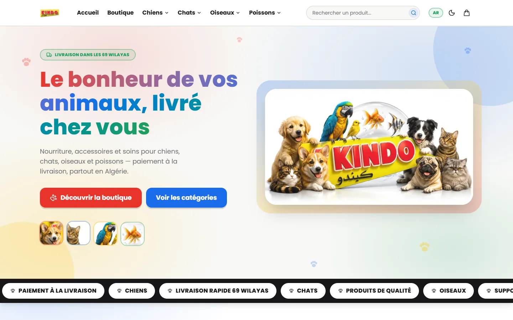
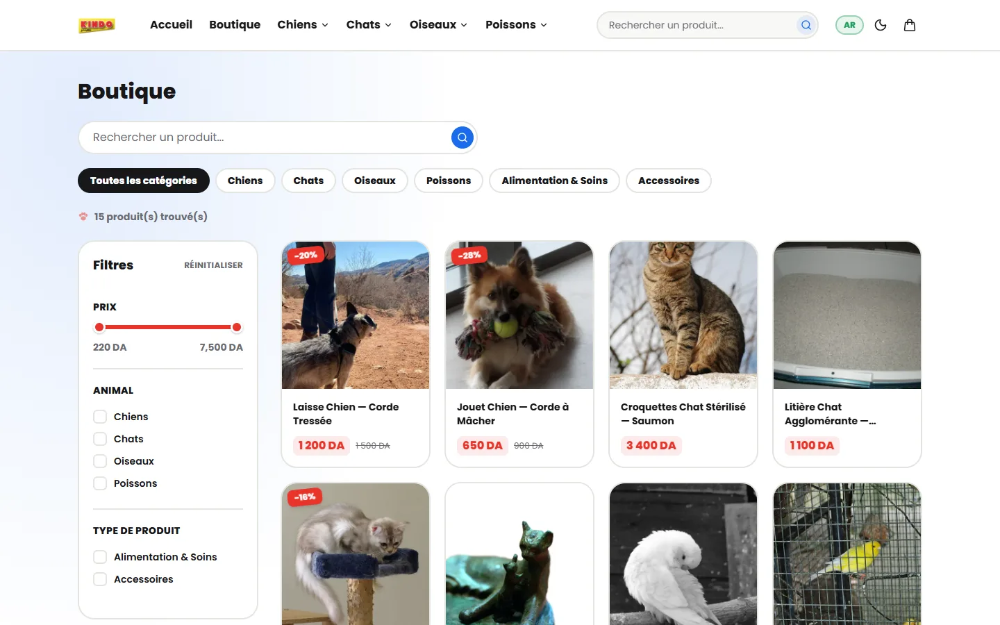
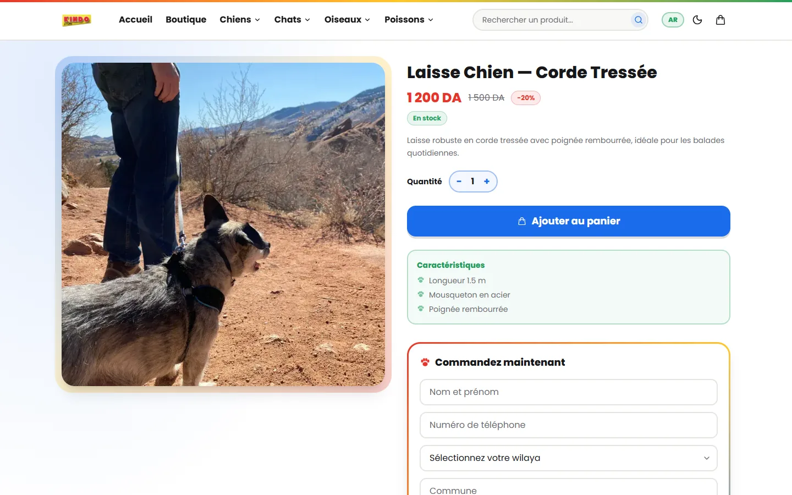
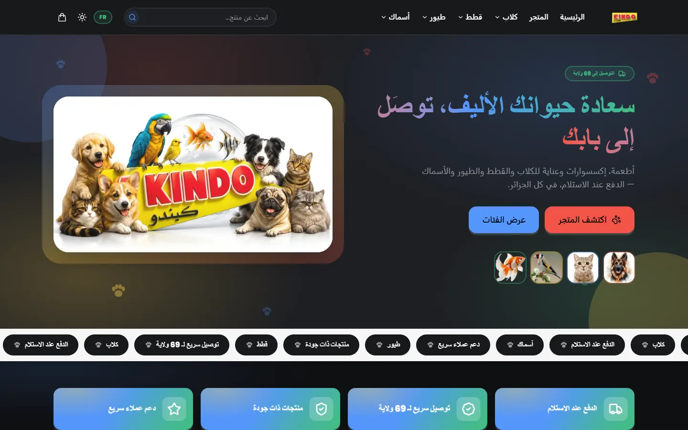
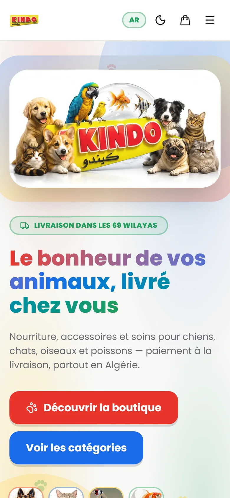
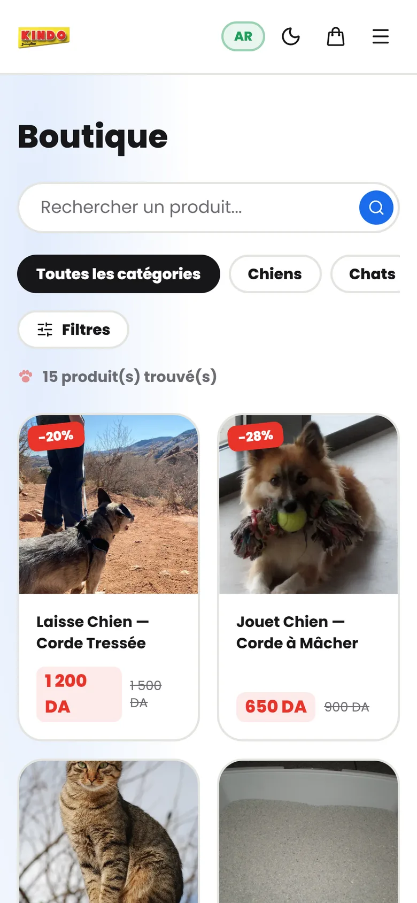
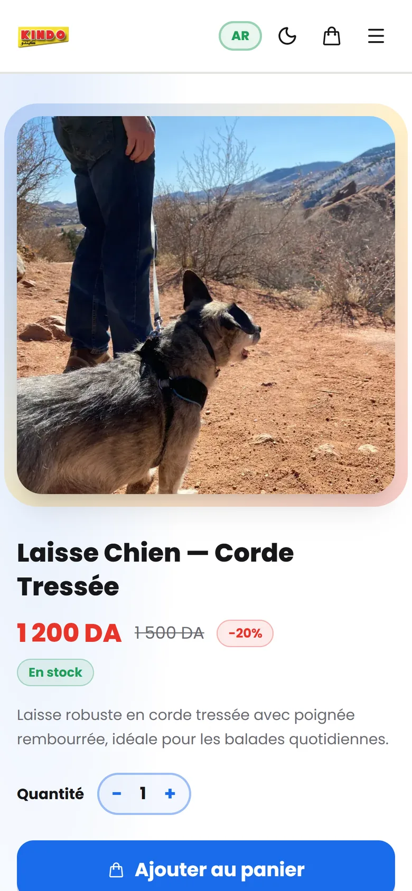
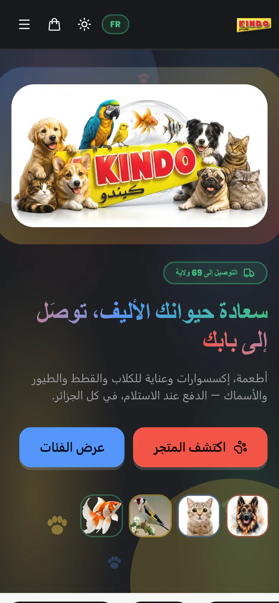

<div align="center">


# KINDO — Animalerie en ligne

**A bilingual (French / Arabic) cash-on-delivery pet store for Algeria, with a full custom admin dashboard.**

[kindodz.com](https://www.kindodz.com)


</div>

---

## Overview

KINDO is a production e-commerce platform for pet food, accessories and care
products (dogs, cats, birds and fish), built for the Algerian market. Customers
browse and order in French or Arabic without creating an account, pay in cash on
delivery, and get delivery prices that the store sets for each of the 69 wilayas.

The store owner runs the business from a custom admin dashboard. From there they
manage the catalogue, categories, orders, delivery prices, reviews, marketing
pixels, policy pages and staff accounts, and none of it needs a developer or a
redeploy.

## Screenshots

### Desktop

| Home | Shop |
| :---: | :---: |
|  |  |
| **Product & one-page checkout** | **Arabic (RTL) · dark mode** |
|  |  |

### Mobile

| Home | Shop | Product | Arabic · dark |
| :---: | :---: | :---: | :---: |
|  |  |  |  |

## Design concept

The visual identity comes straight from the KINDO logo. Its four colours
(**red, blue, green and yellow**) each stand for one of the store's animal
families. The design follows three ideas:

- **Playful, but made for buying.** Paw-print scatters, cats that wander across
  the page, a flip card in the hero, tilt-on-hover cards, wave dividers and a
  scrolling marquee give the store a warm, friendly feel. The product and
  checkout pages stay clean and distraction-free so buying is quick.
- **Mobile first.** Most customers arrive from social media on a phone. Every
  screen is designed for one-handed use first: a slide-in cart drawer, sticky
  actions, and an **inline checkout on the product page** so a visitor can order
  without leaving it.
- **Truly bilingual.** French and Arabic are both first-class languages. In
  Arabic the whole layout mirrors to right-to-left, not just the text. Light and
  dark themes come from one token system, and the saved theme and language are
  applied before the first paint, so returning visitors never see a flash.

## Features

**Storefront**
- French / Arabic interface with full RTL layout, plus light and dark themes
- Catalogue organised as a category tree, with search and filters
- Product variants (colour and custom options) with their own price and stock, and quantity offers
- Cart drawer and one-page checkout; orders are cash on delivery with no customer account needed
- Delivery prices for each of the 69 wilayas, with a choice of home or stop-desk delivery
- Customer reviews, and a policy page the owner can edit

**Admin dashboard**
- Sales and order statistics, order management, and Excel export
- Products, categories, variants, offers, images and product video
- Delivery prices for each wilaya, turned on or off per wilaya
- Meta and TikTok pixels managed from the dashboard, several per store, with events kept separate per pixel
- Staff accounts with permissions for each section of the dashboard, enforced in the database
- Owner account settings and password management

## Tech stack

| Layer | Technology |
| --- | --- |
| Frontend | React 19, TypeScript (strict), Vite |
| Styling | Tailwind CSS v4 (CSS-first `@theme`, design tokens for each theme), Framer Motion |
| State & data | TanStack Query, Zustand (cart), React Router |
| Forms | react-hook-form + zod |
| Backend | Supabase: PostgreSQL, Auth, Storage, Row Level Security, Edge Functions |
| Hosting | Vercel, with Edge Middleware for social link previews |
| Tooling | Bun, ESLint, sharp (asset pipeline) |

## Security

- **Prices are calculated on the server.** Orders go through a single Postgres
  function, `place_order`, which recalculates every price, offer, variant and
  delivery fee from the database. Nothing the browser sends about price is
  trusted.
- **Stock can't be oversold.** Stock rows are locked while an order is placed,
  and cancelling an order returns its stock automatically.
- **Abuse protection.** The server limits how many orders one phone number can
  place, and a store-wide circuit breaker stops sudden bursts of orders. It also
  checks every field and caps cart sizes. Order numbers can't be guessed, and
  forms include a honeypot and a minimum time-to-submit to stop bots.
- **Row Level Security everywhere.** Customers can only read public data.
  Dashboard access is checked for each section by a database function
  (`has_section()`), not only in the interface. Anyone who signs up on their own
  gets no access at all.
- **Privileged actions run on the server.** Creating staff accounts and setting
  their passwords happens in Supabase Edge Functions. The service-role key is
  never sent to the browser.
- **Hardened HTTP headers.** A strict Content-Security-Policy, HSTS with
  preload, `X-Frame-Options`, `nosniff`, `Referrer-Policy` and a restrictive
  `Permissions-Policy`.
- **Upload limits.** Storage buckets only accept allowed file types up to a set
  size.

## Performance

- Every page except the home page is loaded on demand, so the first download
  stays small.
- The main hero image and the logo are preloaded, and the Supabase connection is
  opened early.
- Uploaded images are shrunk and converted to WebP in the browser before
  upload. `SmartImage` then asks Supabase for a version sized to each screen
  (`srcset`) and lazy-loads everything below the fold.
- Images committed to the repo go through a sharp pipeline
  (`bun run optimize:assets`).
- Built assets are cached for a year as immutable files, and static images use
  `stale-while-revalidate`.
- Store data is cached with TanStack Query, and animations turn off when the
  visitor has asked for reduced motion.

## SEO

- Each page sets its own title, description and canonical URL.
- Open Graph and Twitter cards, with French and Arabic locales.
- Structured data (JSON-LD): `Store` for the site and `Product` + `Offer` on
  each product page.
- **Link previews for each product.** A Vercel Edge Middleware detects the bots
  used by Facebook, WhatsApp, Telegram, X and others, and serves them each
  product's own title, image and price. This single-page app would otherwise
  show one generic preview for every link.
- `sitemap.xml` and `robots.txt` are generated from the live catalogue on every
  build.
- Local search tags (`geo.region` DZ), plus semantic HTML with alt text on
  images.

## Project structure

```
src/
  components/   layout, product, shop, ui primitives, visual effects, admin editors
  hooks/        data hooks (TanStack Query) and shared hooks
  i18n/         FR/AR translations and the RTL-aware language provider
  lib/          Supabase client, pricing/offers, tracking, image processing, SEO helpers
  pages/        storefront pages and pages/admin (dashboard)
  store/        Zustand cart store
  theme/        light/dark theme provider
supabase/
  migrations/   schema, RLS policies, RPCs, triggers and seed data (run in order)
  functions/    staff-management Edge Functions (Deno)
scripts/        sitemap generation and asset optimisation
middleware.ts   Vercel Edge link-preview middleware
vercel.json     rewrites, security headers and caching rules
```

## Development

```bash
bun install
cp .env.example .env   # add the Supabase URL + anon key and the site URL
bun run dev
```

| Command | Purpose |
| --- | --- |
| `bun run dev` | Start the development server |
| `bun run build` | Type-check, regenerate the sitemap, then build for production |
| `bun run typecheck` | Run the TypeScript compiler in check mode |
| `bun run lint` | Run ESLint with zero warnings allowed |
| `bun run preview` | Serve the production build locally |

Environment setup, database migrations and the go-live checklist are in
[`docs/DEPLOYMENT.md`](docs/DEPLOYMENT.md).

## Author

Designed and developed by **Alaa Younsi**.

## License

**Copyright © 2026 Alaa Younsi. All rights reserved.**

This is proprietary software. You may not copy, modify, distribute or reuse any
part of it (source code, design, assets or content) in any form without prior
written permission. See [LICENSE](LICENSE) for the full terms.
